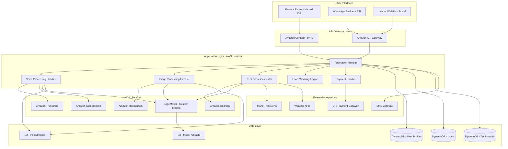
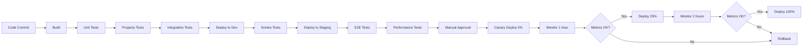

# Design Document: VishwasChain

## Overview

VishwasChain is a serverless, AI-powered micro-lending platform built on AWS that enables rural artisans in India to access fair-interest loans through quantified trust capital. The system operates primarily through voice-based interfaces (missed calls and WhatsApp) to accommodate feature phone users with low digital literacy.

The platform processes multilingual voice testimonials, analyzes craft images, predicts seasonal income patterns, and monitors hyperlocal economic conditions to generate comprehensive trust scores. These scores enable automated loan matching and approval within 48 hours, replacing exploitative moneylender practices with technology-enabled trust verification.

## Architecture

### High-Level Architecture



### Technology Stack

**Frontend:**
- WhatsApp Business API for messaging interface
- Amazon Connect for IVRS (Interactive Voice Response System)
- React.js for lender web dashboard
- Responsive design for mobile and desktop

**Backend:**
- AWS Lambda (Node.js/Python) for serverless compute
- Amazon API Gateway for REST APIs
- Amazon EventBridge for event-driven workflows
- AWS Step Functions for orchestrating complex workflows

**AI/ML:**
- Amazon Transcribe for speech-to-text (multilingual)
- Amazon Comprehend for sentiment analysis
- Amazon Rekognition for image analysis
- Amazon Bedrock (Claude/Titan) for natural language understanding
- Amazon SageMaker for custom ML models (voice authenticity, skill assessment)

**Data Storage:**
- Amazon DynamoDB for transactional data
- Amazon S3 for voice recordings, images, and ML artifacts
- Amazon ElastiCache (Redis) for session management and caching

**Security:**
- AWS KMS for encryption key management
- AWS Secrets Manager for API keys and credentials
- AWS WAF for web application firewall
- Amazon Cognito for lender authentication

**Monitoring:**
- Amazon CloudWatch for logging and metrics
- AWS X-Ray for distributed tracing
- Amazon SNS for alerting

## Components and Interfaces

### 1. Missed Call Gateway

**Purpose:** Handle incoming missed calls and initiate callback with IVRS menu.

**Technology:** Amazon Connect

**Interface:**
```typescript
interface MissedCallRequest {
  phoneNumber: string;
  timestamp: Date;
  callerId: string;
}

interface IVRSResponse {
  sessionId: string;
  language: string;
  menuOptions: string[];
  audioPromptUrl: string;
}
```

**Workflow:**
1. Artisan dials missed call number
2. System captures phone number and disconnects
3. Within 60 seconds, system initiates callback
4. IVRS presents language selection menu
5. Based on selection, routes to appropriate flow (new application, status check, support)

### 2. Voice Processing Module

**Purpose:** Transcribe, analyze, and authenticate voice inputs.

**Components:**
- Speech-to-Text Engine (Amazon Transcribe)
- Sentiment Analysis (Amazon Comprehend)
- Voice Authenticity Detector (Custom SageMaker model)
- Voiceprint Storage and Matching

**Interface:**
```typescript
interface VoiceInput {
  audioUrl: string;
  language: string;
  speakerPhoneNumber: string;
  recordingDuration: number;
}

interface VoiceProcessingResult {
  transcription: string;
  confidence: number;
  sentiment: {
    positive: number;
    negative: number;
    neutral: number;
    mixed: number;
  };
  authenticity: {
    isAuthentic: boolean;
    confidence: number;
    deepfakeDetected: boolean;
    replayDetected: boolean;
  };
  voiceprintId: string;
}
```

**Voice Authenticity Detection Model:**
- Architecture: CNN + LSTM for temporal audio feature extraction
- Training: Federated learning on genuine testimonials + synthetic audio dataset
- Features: Mel-frequency cepstral coefficients (MFCCs), spectral features, prosody
- Output: Binary classification (authentic/fake) with confidence score

### 3. Craft Assessment Module

**Purpose:** Analyze craft images to assess skill level and quality.

**Components:**
- Image Classification (Amazon Rekognition Custom Labels)
- Quality Assessment Model (Custom SageMaker model)
- Portfolio Aggregation Engine

**Interface:**
```typescript
interface CraftImage {
  imageUrl: string;
  artisanId: string;
  uploadTimestamp: Date;
  metadata: {
    fileSize: number;
    dimensions: { width: number; height: number };
    format: string;
  };
}

interface CraftAssessmentResult {
  craftType: string; // weaving, pottery, metalwork, etc.
  craftTypeConfidence: number;
  qualityScore: number; // 0-100
  qualityDimensions: {
    symmetry: number;
    detailLevel: number;
    finish: number;
    complexity: number;
    colorHarmony: number;
  };
  suggestedImprovements: string[];
  portfolioScore: number; // aggregated across all images
}
```

**Quality Assessment Model:**
- Architecture: ResNet-50 backbone + custom quality regression head
- Training: Transfer learning on craft image dataset with expert annotations
- Features: Symmetry detection, edge sharpness, color distribution, pattern recognition
- Output: Multi-dimensional quality scores

### 4. Trust Score Engine

**Purpose:** Calculate comprehensive trust score from multiple data sources.

**Interface:**
```typescript
interface TrustScoreInput {
  artisanId: string;
  testimonials: Testimonial[];
  craftAssessment: CraftAssessmentResult;
  transactionHistory: Transaction[];
  economicContext: EconomicHealthIndex;
}

interface TrustScore {
  overallScore: number; // 0-1000
  components: {
    testimonialScore: number; // 40% weight
    craftQualityScore: number; // 30% weight
    transactionScore: number; // 20% weight
    economicContextScore: number; // 10% weight
  };
  riskLevel: 'LOW' | 'MEDIUM' | 'HIGH';
  confidence: number;
  lastUpdated: Date;
}
```

**Trust Score Algorithm:**

```
TrustScore = (0.4 × TestimonialScore) + (0.3 × CraftScore) + (0.2 × TransactionScore) + (0.1 × EconomicScore)

Where:

TestimonialScore = Σ(AuthenticityWeight × SentimentScore × VoucherCredibility) / NumTestimonials
  - AuthenticityWeight: 1.0 if authentic, 0.0 if fake
  - SentimentScore: Normalized sentiment (0-100)
  - VoucherCredibility: Based on voucher's own trust score and testimonial history

CraftScore = PortfolioScore (0-100 from Craft Assessment Module)

TransactionScore = (ConsistencyScore × 0.5) + (VolumeScore × 0.3) + (GrowthScore × 0.2)
  - ConsistencyScore: Regularity of income (coefficient of variation)
  - VolumeScore: Average monthly transaction volume
  - GrowthScore: Income trend over time

EconomicScore = (RegionalHealthIndex × 0.6) + (CraftDemandIndex × 0.4)
  - RegionalHealthIndex: District-level economic indicators
  - CraftDemandIndex: Market demand for specific craft type

Final normalization: Scale to 0-1000 range
```

### 5. Seasonal Income Prediction Model

**Purpose:** Predict artisan income patterns for repayment capacity assessment.

**Interface:**
```typescript
interface TransactionHistory {
  artisanId: string;
  transactions: Array<{
    date: Date;
    amount: number;
    type: 'CREDIT' | 'DEBIT';
    source: string;
  }>;
  historicalMonths: number;
}

interface IncomePrediction {
  monthlyPredictions: Array<{
    month: string;
    predictedIncome: number;
    confidenceInterval: {
      lower: number;
      upper: number;
    };
    confidence: number; // 0-1
  }>;
  seasonalPattern: {
    peakMonths: string[];
    lowMonths: string[];
    seasonalityStrength: number;
  };
  recommendedLoanAmount: number;
  recommendedRepaymentSchedule: RepaymentSchedule;
}
```

**Income Prediction Model:**
- Algorithm: SARIMA (Seasonal AutoRegressive Integrated Moving Average) + XGBoost ensemble
- Features: Historical transaction amounts, festival calendar, regional craft demand, weather patterns
- Training: Per-craft-type models with regional adjustments
- Output: Monthly income predictions with 80% confidence intervals

### 6. Hyperlocal Economic Health Index

**Purpose:** Monitor regional economic conditions to adjust risk assessments.

**Interface:**
```typescript
interface EconomicHealthIndex {
  districtCode: string;
  timestamp: Date;
  indicators: {
    mandiPriceIndex: number; // Raw material price trends
    weatherScore: number; // Favorable conditions for craft production
    festivalProximity: number; // Days to next major festival
    employmentRate: number;
    inflationRate: number;
  };
  overallHealthScore: number; // 0-100
  trend: 'IMPROVING' | 'STABLE' | 'DECLINING';
  riskAdjustmentFactor: number; // Multiplier for trust scores
}
```

**Data Sources:**
- Mandi price APIs (Government of India Agmarknet)
- Weather APIs (India Meteorological Department)
- Festival calendar database
- Regional economic statistics (NSSO, Census data)

**Calculation:**
```
HealthScore = (0.3 × MandiPriceStability) + (0.2 × WeatherFavorability) + 
              (0.2 × FestivalDemand) + (0.15 × Employment) + (0.15 × InflationControl)

RiskAdjustmentFactor = 1.0 + ((HealthScore - 50) / 100)
  - Ranges from 0.5 (poor economy) to 1.5 (strong economy)
```

### 7. Loan Matching Engine

**Purpose:** Match approved artisan applications with suitable lenders.

**Interface:**
```typescript
interface LoanApplication {
  artisanId: string;
  loanAmount: number;
  purpose: string;
  trustScore: number;
  craftType: string;
  region: string;
  urgency: 'HIGH' | 'MEDIUM' | 'LOW';
}

interface LenderPreferences {
  lenderId: string;
  minTrustScore: number;
  maxTrustScore: number;
  preferredCraftTypes: string[];
  preferredRegions: string[];
  availableCapital: number;
  riskTolerance: 'LOW' | 'MEDIUM' | 'HIGH';
  socialImpactGoals: string[];
}

interface LoanMatch {
  artisanId: string;
  matchedLenders: Array<{
    lenderId: string;
    matchScore: number; // 0-100
    fundingPercentage: number; // For partial funding
    estimatedApprovalTime: number; // hours
  }>;
  recommendedInterestRate: number; // 12-18%
  recommendedTenure: number; // months
}
```

**Matching Algorithm:**
```
MatchScore = (0.4 × TrustScoreAlignment) + (0.3 × PreferenceMatch) + 
             (0.2 × CapitalAvailability) + (0.1 × HistoricalSpeed)

Where:
- TrustScoreAlignment: How well artisan trust score fits lender's range
- PreferenceMatch: Overlap in craft type and region preferences
- CapitalAvailability: Lender's available capital vs loan amount
- HistoricalSpeed: Lender's average approval time

Interest Rate Calculation:
BaseRate = 12%
RiskPremium = (1000 - TrustScore) / 100 × 0.6%
FinalRate = BaseRate + RiskPremium (capped at 18%)
```

### 8. WhatsApp Bot

**Purpose:** Provide conversational interface for status updates and interactions.

**Technology:** WhatsApp Business API + Amazon Lex for NLU

**Interface:**
```typescript
interface WhatsAppMessage {
  from: string; // Phone number
  messageId: string;
  messageType: 'text' | 'image' | 'audio' | 'interactive';
  content: string | Buffer;
  timestamp: Date;
}

interface BotResponse {
  to: string;
  messageType: 'text' | 'interactive' | 'template';
  content: string;
  buttons?: Array<{
    id: string;
    title: string;
  }>;
  templateName?: string;
  templateParams?: Record<string, string>;
}
```

**Conversation Flows:**

1. **Status Check:**
   - User: "मेरे loan का status क्या है?" (What's my loan status?)
   - Bot: Retrieves application, responds with current stage and next steps

2. **Document Upload:**
   - Bot: "कृपया अपने काम की 3 तस्वीरें भेजें" (Please send 3 photos of your work)
   - User: Sends images
   - Bot: Confirms receipt, initiates craft assessment

3. **Repayment Reminder:**
   - Bot: "आपकी किस्त ₹5,000 की 3 दिन में देय है। UPI से भुगतान करें: [link]"
   - (Your installment of ₹5,000 is due in 3 days. Pay via UPI: [link])

### 9. Payment Integration Module

**Purpose:** Handle loan disbursement and repayment via UPI.

**Interface:**
```typescript
interface DisbursementRequest {
  loanId: string;
  artisanId: string;
  amount: number;
  upiId?: string;
  bankAccount?: {
    accountNumber: string;
    ifscCode: string;
    accountHolderName: string;
  };
}

interface RepaymentRequest {
  loanId: string;
  amount: number;
  paymentMethod: 'UPI' | 'BANK_TRANSFER';
  transactionId: string;
}

interface PaymentResult {
  success: boolean;
  transactionId: string;
  timestamp: Date;
  errorMessage?: string;
  retryAttempt?: number;
}
```

**UPI Integration:**
- Payment Gateway: Razorpay / Paytm / PhonePe
- Generate dynamic UPI payment links
- Webhook for payment confirmation
- Automatic reconciliation with loan records

## Data Models

### User Profile (DynamoDB)

```typescript
interface ArtisanProfile {
  PK: string; // "ARTISAN#{artisanId}"
  SK: string; // "PROFILE"
  artisanId: string;
  phoneNumber: string;
  name: string;
  language: string;
  craftType: string;
  village: string;
  district: string;
  state: string;
  pincode: string;
  registrationDate: Date;
  kycStatus: 'PENDING' | 'VERIFIED' | 'REJECTED';
  kycDocuments: {
    aadhaarNumber?: string; // Encrypted
    panNumber?: string;
    verificationDate?: Date;
  };
  upiId?: string;
  bankAccount?: {
    accountNumber: string; // Encrypted
    ifscCode: string;
    accountHolderName: string;
  };
  trustScore: number;
  totalLoansReceived: number;
  totalLoansRepaid: number;
  currentOutstanding: number;
  defaultCount: number;
  coordinatorId?: string;
  createdAt: Date;
  updatedAt: Date;
}

interface LenderProfile {
  PK: string; // "LENDER#{lenderId}"
  SK: string; // "PROFILE"
  lenderId: string;
  email: string;
  phoneNumber: string;
  name: string;
  lenderType: 'INDIVIDUAL' | 'NRI' | 'IMPACT_FUND' | 'ORGANIZATION';
  preferences: LenderPreferences;
  totalLent: number;
  activeLoans: number;
  portfolioValue: number;
  defaultRate: number;
  averageApprovalTime: number; // hours
  createdAt: Date;
  updatedAt: Date;
}

interface CoordinatorProfile {
  PK: string; // "COORDINATOR#{coordinatorId}"
  SK: string; // "PROFILE"
  coordinatorId: string;
  phoneNumber: string;
  name: string;
  village: string;
  district: string;
  state: string;
  artisansOnboarded: number;
  successfulLoans: number;
  repaymentRate: number;
  incentivePoints: number;
  createdAt: Date;
  updatedAt: Date;
}
```

### Loan Records (DynamoDB)

```typescript
interface LoanRecord {
  PK: string; // "LOAN#{loanId}"
  SK: string; // "DETAILS"
  loanId: string;
  artisanId: string;
  lenderId: string;
  applicationDate: Date;
  approvalDate?: Date;
  disbursementDate?: Date;
  loanAmount: number;
  interestRate: number;
  tenure: number; // months
  emiAmount: number;
  purpose: string;
  status: 'APPLIED' | 'UNDER_REVIEW' | 'APPROVED' | 'DISBURSED' | 'ACTIVE' | 'COMPLETED' | 'DEFAULTED' | 'REJECTED';
  trustScoreAtApplication: number;
  repaymentSchedule: Array<{
    installmentNumber: number;
    dueDate: Date;
    amount: number;
    status: 'PENDING' | 'PAID' | 'OVERDUE';
    paidDate?: Date;
    paidAmount?: number;
    transactionId?: string;
  }>;
  outstandingBalance: number;
  totalPaid: number;
  daysOverdue: number;
  rejectionReason?: string;
  createdAt: Date;
  updatedAt: Date;
}
```

### Testimonials (DynamoDB)

```typescript
interface Testimonial {
  PK: string; // "ARTISAN#{artisanId}"
  SK: string; // "TESTIMONIAL#{testimonialId}"
  testimonialId: string;
  artisanId: string;
  voucherPhoneNumber: string;
  voucherName?: string;
  audioUrl: string;
  transcription: string;
  language: string;
  sentiment: {
    positive: number;
    negative: number;
    neutral: number;
    mixed: number;
  };
  authenticity: {
    isAuthentic: boolean;
    confidence: number;
  };
  voiceprintId: string;
  voucherCredibility: number;
  weightInTrustScore: number;
  recordedAt: Date;
  processedAt: Date;
}
```

### Craft Portfolio (DynamoDB)

```typescript
interface CraftPortfolio {
  PK: string; // "ARTISAN#{artisanId}"
  SK: string; // "PORTFOLIO"
  artisanId: string;
  images: Array<{
    imageId: string;
    imageUrl: string;
    uploadDate: Date;
    craftType: string;
    qualityScore: number;
    qualityDimensions: {
      symmetry: number;
      detailLevel: number;
      finish: number;
      complexity: number;
      colorHarmony: number;
    };
  }>;
  overallPortfolioScore: number;
  lastUpdated: Date;
}
```

### Transaction History (DynamoDB)

```typescript
interface TransactionRecord {
  PK: string; // "ARTISAN#{artisanId}"
  SK: string; // "TRANSACTION#{timestamp}"
  transactionId: string;
  artisanId: string;
  date: Date;
  amount: number;
  type: 'CREDIT' | 'DEBIT';
  source: string; // SMS, WhatsApp, UPI notification
  category?: string; // raw_material_purchase, sale, etc.
  extractedAt: Date;
}
```

## Correctness Properties

*A property is a characteristic or behavior that should hold true across all valid executions of a system—essentially, a formal statement about what the system should do. Properties serve as the bridge between human-readable specifications and machine-verifiable correctness guarantees.*

Before defining the correctness properties, let me analyze the acceptance criteria for testability:


### Property Reflection

After analyzing all acceptance criteria, I've identified several areas where properties can be consolidated:

**Timing Properties:** Multiple requirements specify timing constraints (callback within 60s, response within 2 minutes, etc.). These can be consolidated into a general "timing constraint" property that validates all time-bound operations.

**Notification Properties:** Many requirements specify SMS/WhatsApp notifications at various stages. These can be consolidated into properties about notification delivery and timing.

**Score Range Properties:** Multiple requirements specify score ranges (0-100, 0-1000). These can be consolidated into a property about score normalization.

**Data Format Properties:** Several requirements specify accepted formats (JPEG/PNG/WebP, language support). These can be consolidated into format validation properties.

**Threshold-Based Routing:** Multiple requirements use thresholds for routing decisions (trust score ranges, economic indicators). These can be consolidated into threshold-based decision properties.

After consolidation, the following properties provide comprehensive coverage without redundancy:

### Correctness Properties

Property 1: **Callback Timing Guarantee**
*For any* missed call from an artisan, the system should initiate a callback within 60 seconds of call registration.
**Validates: Requirements 1.1**

Property 2: **Language Consistency**
*For any* user session, once a language is selected, all subsequent voice prompts and messages should use that same language throughout the session.
**Validates: Requirements 2.5**

Property 3: **Transcription Quality Threshold**
*For any* voice input in a supported language, the transcription accuracy should be at least 90% when compared to ground truth.
**Validates: Requirements 2.2**

Property 4: **Sentiment Detection Accuracy**
*For any* voice testimonial with known sentiment labels, the detected sentiment should match the ground truth with at least 85% accuracy.
**Validates: Requirements 2.3**

Property 5: **Audio Authenticity Detection**
*For any* audio sample (genuine or synthetic), the voice authenticity detector should correctly classify it with at least 95% accuracy.
**Validates: Requirements 3.3, 16.1**

Property 6: **Self-Testimonial Prevention**
*For any* testimonial submission, if the voucher phone number equals the artisan phone number, the system should reject the testimonial.
**Validates: Requirements 3.5**

Property 7: **Dual Notification on Testimonial**
*For any* successfully recorded testimonial, the system should send exactly two SMS confirmations: one to the voucher and one to the artisan.
**Validates: Requirements 3.6**

Property 8: **Image Format Validation**
*For any* uploaded craft image, the system should accept JPEG, PNG, and WebP formats and reject all other formats.
**Validates: Requirements 4.1**

Property 9: **Craft Classification Accuracy**
*For any* craft image with known craft type labels, the classification should match the ground truth with at least 85% accuracy.
**Validates: Requirements 4.2**

Property 10: **Quality Assessment Completeness**
*For any* craft image assessment, the result should include scores for all required dimensions: symmetry, detail, finish, complexity, and color harmony.
**Validates: Requirements 4.3**

Property 11: **Skill Score Range**
*For any* craft portfolio assessment, the generated skill score should be within the range [0, 100].
**Validates: Requirements 4.5**

Property 12: **Trust Score Component Weighting**
*For any* trust score calculation, changing only the testimonial component should affect the final score by 40% of the change, craft quality by 30%, transaction patterns by 20%, and economic context by 10%.
**Validates: Requirements 5.2**

Property 13: **Low Authenticity Exclusion**
*For any* testimonial with authenticity confidence below 95%, that testimonial should not contribute to the trust score calculation.
**Validates: Requirements 5.3**

Property 14: **Trust Score Range**
*For any* artisan, the calculated trust score should be within the range [0, 1000].
**Validates: Requirements 5.4**

Property 15: **Significant Score Change Notification**
*For any* trust score update where the change exceeds 50 points, the system should send an SMS notification to the artisan.
**Validates: Requirements 5.5**

Property 16: **Transaction Source Integration**
*For any* artisan with transaction data, the extracted transactions should include entries from both SMS notifications and WhatsApp payment confirmations.
**Validates: Requirements 6.1**

Property 17: **Minimum History for Seasonality**
*For any* income prediction request, seasonal patterns should only be calculated if at least 6 months of transaction history exists.
**Validates: Requirements 6.2**

Property 18: **Confidence Interval Statistical Rigor**
*For any* monthly income prediction, the confidence interval should be calculated such that 80% of actual outcomes fall within the predicted range.
**Validates: Requirements 6.4**

Property 19: **Economic Deterioration Response**
*For any* region where economic indicators deteriorate by more than 20%, the regional risk scores should be adjusted downward.
**Validates: Requirements 7.3**

Property 20: **Lender Matching Criteria**
*For any* approved artisan application, all matched lenders should satisfy the loan amount requirement, risk tolerance alignment, and regional preference match.
**Validates: Requirements 8.1**

Property 21: **Match Result Count**
*For any* lender in the matching process, the system should present at most 5 artisan profiles (or fewer if insufficient matches exist).
**Validates: Requirements 8.2**

Property 22: **Lender Prioritization by Speed**
*For any* set of interested lenders, those with faster historical approval times should be ranked higher in the priority list.
**Validates: Requirements 8.3**

Property 23: **Notification Timing Guarantee**
*For any* confirmed loan match, both the artisan and lender should receive notifications within 15 minutes.
**Validates: Requirements 8.5**

Property 24: **WhatsApp Response Timing**
*For any* message sent by an artisan to the WhatsApp bot, a response with current status should be delivered within 2 minutes.
**Validates: Requirements 9.2**

Property 25: **Repayment Reminder Schedule**
*For any* upcoming loan repayment, reminder messages should be sent exactly at 7 days, 3 days, and 1 day before the due date.
**Validates: Requirements 9.4**

Property 26: **Trust-Based Auto-Approval**
*For any* loan application with trust score exceeding 600 and amount up to ₹25,000, the system should automatically approve without manual review.
**Validates: Requirements 10.2**

Property 27: **Trust-Based Routing**
*For any* loan application, if trust score is between 400-600, it should be flagged for manual review; if below 400, it should be rejected; if above 600, it should be auto-approved.
**Validates: Requirements 10.2, 10.3, 10.4**

Property 28: **Approval Process Timing**
*For any* loan application with all required data, the complete approval process should finish within 48 hours of submission.
**Validates: Requirements 10.5**

Property 29: **Disbursement Timing**
*For any* approved loan, funds should be disbursed via UPI or bank transfer within 4 hours of approval.
**Validates: Requirements 11.1**

Property 30: **Disbursement Verification Precedence**
*For any* loan disbursement, bank account or UPI ID verification should complete successfully before funds are transferred.
**Validates: Requirements 11.2**

Property 31: **Disbursement Retry Logic**
*For any* failed disbursement, the system should retry up to 3 times with 1-hour intervals between attempts.
**Validates: Requirements 11.4**

Property 32: **UPI Link Uniqueness**
*For any* two different repayment installments, the generated UPI payment links should be distinct.
**Validates: Requirements 12.1**

Property 33: **Balance Update Timing**
*For any* received repayment, the loan balance should be updated within 5 minutes of payment confirmation.
**Validates: Requirements 12.2**

Property 34: **On-Time Payment Reward**
*For any* repayment completed on or before the due date, the artisan's trust score should increase by 10-20 points.
**Validates: Requirements 12.3**

Property 35: **Late Payment Penalty**
*For any* repayment that is more than 7 days overdue, the artisan's trust score should decrease by 30-50 points.
**Validates: Requirements 12.4**

Property 36: **Partial Payment Balance Calculation**
*For any* partial payment on a loan, the remaining balance should equal the previous balance minus the payment amount.
**Validates: Requirements 12.5**

Property 37: **Data Encryption at Rest**
*For any* stored voice recording, image, or transaction data, the data should be encrypted using AES-256.
**Validates: Requirements 13.2**

Property 38: **Data Encryption in Transit**
*For any* data transmission between system components, the connection should use TLS 1.3 encryption.
**Validates: Requirements 13.3**

Property 39: **Training Data Anonymization**
*For any* data used in model training, personally identifiable information (name, phone number, address, Aadhaar) should be removed or anonymized.
**Validates: Requirements 13.4**

Property 40: **Data Deletion Timing**
*For any* artisan data deletion request, all personal data should be removed from the system within 30 days.
**Validates: Requirements 13.5**

Property 41: **Consent Before Collection**
*For any* voice recording, image upload, or transaction data extraction, explicit user consent should be recorded before data collection begins.
**Validates: Requirements 13.6**

Property 42: **Portfolio Metrics Completeness**
*For any* lender portfolio view, the displayed metrics should include total disbursed, outstanding balance, default rate, and social impact score.
**Validates: Requirements 14.2**

Property 43: **Default Notification Timing**
*For any* loan that enters default status, the lender should receive a notification within 24 hours.
**Validates: Requirements 14.5**

Property 44: **Coordinator Attribution**
*For any* loan application assisted by a coordinator, the coordinator ID should be recorded in the application record.
**Validates: Requirements 15.2**

Property 45: **Coordinator Incentive on Repayment**
*For any* coordinator-assisted loan that is successfully repaid in full, incentive points should be credited to the coordinator's account.
**Validates: Requirements 15.5**

Property 46: **Duplicate Application Detection**
*For any* set of applications originating from the same device or location within 24 hours, the system should flag them for fraud review.
**Validates: Requirements 16.2**

Property 47: **Suspicious Pattern Response**
*For any* application where suspicious patterns are detected, the application should be temporarily suspended and administrators should be notified.
**Validates: Requirements 16.4**

Property 48: **Audit Log Retention**
*For any* transaction or system action, an audit log entry should be created and retained for at least 7 years.
**Validates: Requirements 16.5**

Property 49: **Rate Limiting**
*For any* phone number, the system should reject application attempts beyond 5 per month.
**Validates: Requirements 16.6**

Property 50: **Voice Transcription Performance**
*For any* 5-minute audio clip, transcription should complete within 30 seconds.
**Validates: Requirements 17.2**

Property 51: **Image Analysis Performance**
*For any* uploaded craft image, quality assessment should complete within 60 seconds.
**Validates: Requirements 17.3**

Property 52: **Auto-Scaling Trigger**
*For any* measurement period where system load exceeds 80% capacity, compute resources should be automatically scaled up.
**Validates: Requirements 17.5**

Property 53: **KYC Verification Requirement**
*For any* loan approval, KYC verification using Aadhaar or alternative government ID should be completed successfully.
**Validates: Requirements 18.2**

Property 54: **Credit Bureau Reporting**
*For any* loan transaction (disbursement or repayment), a report should be sent to credit bureaus.
**Validates: Requirements 18.3**

Property 55: **AML Record Maintenance**
*For any* loan transaction, records required for anti-money laundering compliance should be created and maintained.
**Validates: Requirements 18.5**

Property 56: **Transparent Terms Display**
*For any* loan before disbursement, all terms, interest rates, and fees should be displayed to the artisan.
**Validates: Requirements 18.6**

Property 57: **Offline Request Queuing**
*For any* missed call request during network outage, the request should be queued and processed when connectivity is restored.
**Validates: Requirements 19.1**

Property 58: **Offline Sync Timing**
*For any* offline data, synchronization should complete within 15 minutes of connectivity restoration.
**Validates: Requirements 19.3**

Property 59: **Retry with Exponential Backoff**
*For any* critical operation that fails due to connectivity, the system should retry up to 5 times with exponentially increasing intervals.
**Validates: Requirements 19.4**

Property 60: **Daily Report Generation**
*For any* day, reports on application volume, approval rates, disbursement amounts, and repayment rates should be generated.
**Validates: Requirements 20.1**

Property 61: **Regional Performance Breakdown**
*For any* performance report, data should be broken down by state and district.
**Validates: Requirements 20.3**

Property 62: **High Default Rate Alerting**
*For any* region where default rate exceeds 5%, an alert notification should be generated.
**Validates: Requirements 20.5**

Property 63: **Report Export Formats**
*For any* generated report, the system should support export in both CSV and PDF formats.
**Validates: Requirements 20.6**

## Error Handling

### Error Categories

**1. User Input Errors:**
- Invalid phone number format
- Unsupported language selection
- Invalid image format
- Insufficient image quality
- Missing required data

**Response Strategy:**
- Provide clear error messages in user's language
- Suggest corrective actions
- Allow retry without penalty
- Log for analytics but don't flag as fraud

**2. System Errors:**
- AWS service failures (Transcribe, Rekognition, etc.)
- Database connection issues
- External API failures (UPI, mandi prices, weather)
- Timeout errors

**Response Strategy:**
- Implement exponential backoff retry (up to 5 attempts)
- Fallback to cached data when available
- Queue operations for later processing
- Alert operations team for persistent failures
- Maintain user session state across retries

**3. Data Quality Errors:**
- Low transcription confidence
- Ambiguous craft type classification
- Insufficient transaction history
- Missing economic data

**Response Strategy:**
- Request additional data from user
- Use fallback values (regional benchmarks)
- Lower confidence scores appropriately
- Flag for manual review if critical

**4. Fraud Detection Errors:**
- Synthetic voice detected
- Duplicate applications
- Self-testimonials
- Suspicious patterns

**Response Strategy:**
- Immediately suspend application
- Notify security team
- Request additional verification
- Maintain audit trail
- Allow appeal process

**5. Payment Errors:**
- Invalid UPI ID
- Bank account verification failure
- Insufficient lender funds
- Payment gateway timeout

**Response Strategy:**
- Retry with exponential backoff (3 attempts)
- Notify both parties of failure
- Request updated payment details
- Maintain transaction idempotency
- Rollback on persistent failure

### Error Response Format

```typescript
interface ErrorResponse {
  errorCode: string;
  errorMessage: string;
  errorMessageLocal: string; // In user's language
  suggestedAction: string;
  retryable: boolean;
  supportContact?: string;
  timestamp: Date;
}
```

### Circuit Breaker Pattern

For external service calls (AWS AI services, payment gateways, external APIs):
- Open circuit after 5 consecutive failures
- Half-open after 60 seconds
- Close after 3 consecutive successes
- Fallback to cached data or degraded functionality

## Testing Strategy

### Dual Testing Approach

VishwasChain requires both unit testing and property-based testing to ensure correctness:

**Unit Tests:** Verify specific examples, edge cases, and error conditions
- Specific loan application scenarios
- Edge cases (empty inputs, boundary values)
- Error handling paths
- Integration points between components

**Property Tests:** Verify universal properties across all inputs
- Trust score calculation properties
- Timing guarantees
- Data validation rules
- Score range constraints

Both approaches are complementary and necessary for comprehensive coverage. Unit tests catch concrete bugs in specific scenarios, while property tests verify general correctness across the input space.

### Property-Based Testing Configuration

**Framework:** fast-check (for TypeScript/JavaScript components) and Hypothesis (for Python components)

**Configuration:**
- Minimum 100 iterations per property test
- Each test must reference its design document property
- Tag format: `Feature: vishwas-chain, Property {number}: {property_text}`

**Example Property Test:**

```typescript
import fc from 'fast-check';

// Feature: vishwas-chain, Property 14: Trust Score Range
test('trust score should always be between 0 and 1000', () => {
  fc.assert(
    fc.property(
      fc.record({
        testimonials: fc.array(fc.record({
          authenticity: fc.float({ min: 0, max: 1 }),
          sentiment: fc.float({ min: 0, max: 100 }),
          voucherCredibility: fc.float({ min: 0, max: 1 })
        })),
        craftScore: fc.float({ min: 0, max: 100 }),
        transactionScore: fc.float({ min: 0, max: 100 }),
        economicScore: fc.float({ min: 0, max: 100 })
      }),
      (input) => {
        const trustScore = calculateTrustScore(input);
        expect(trustScore).toBeGreaterThanOrEqual(0);
        expect(trustScore).toBeLessThanOrEqual(1000);
      }
    ),
    { numRuns: 100 }
  );
});
```

### Test Coverage Requirements

**Unit Test Coverage:**
- Minimum 80% code coverage
- 100% coverage for critical paths (trust score, loan approval, payment)
- All error handling paths tested

**Property Test Coverage:**
- All 63 correctness properties implemented as property tests
- Each property test runs minimum 100 iterations
- Properties tested with realistic data generators

**Integration Test Coverage:**
- End-to-end loan application flow
- Voice testimonial processing pipeline
- Craft assessment workflow
- Payment disbursement and repayment
- WhatsApp bot conversations

**Performance Test Coverage:**
- Load testing: 10,000 concurrent missed calls
- Stress testing: Peak festival season traffic
- Endurance testing: 24-hour continuous operation
- Scalability testing: Auto-scaling behavior

### Test Data Generation

**Voice Data:**
- Synthetic voice samples in all 8 supported languages
- Genuine testimonials (with consent)
- Deepfake samples for authenticity testing
- Various audio qualities and background noise levels

**Image Data:**
- Craft images across all craft types
- Various quality levels (poor to excellent)
- Different angles and lighting conditions
- Edge cases (blurry, partial, multiple items)

**Transaction Data:**
- Seasonal patterns (festival peaks, lean periods)
- Various income levels and consistency
- Edge cases (no history, irregular patterns)

**Economic Data:**
- Historical mandi prices
- Weather patterns
- Festival calendars
- Regional variations

### Continuous Testing

**Pre-Deployment:**
- All unit tests must pass
- All property tests must pass
- Integration tests must pass
- Performance benchmarks must be met

**Post-Deployment:**
- Canary deployments with 5% traffic
- Monitor error rates and latency
- A/B testing for ML model updates
- Gradual rollout to 100%

**Monitoring:**
- Real-time property validation in production
- Anomaly detection on trust scores
- ML model drift detection
- User feedback analysis

## Deployment Strategy

### Infrastructure as Code

**Tool:** AWS CDK (TypeScript)

**Environments:**
- Development: Single region, minimal resources
- Staging: Production-like, single region
- Production: Multi-region (Mumbai, Hyderabad), full redundancy

### Deployment Pipeline



### Rollback Strategy

**Automated Rollback Triggers:**
- Error rate > 1%
- Latency p99 > 5 seconds
- Trust score calculation failures > 0.1%
- Payment failures > 2%

**Manual Rollback:**
- Critical bug discovered
- Security vulnerability
- Data corruption detected

**Rollback Process:**
- Immediate traffic shift to previous version
- Database migration rollback (if needed)
- Notification to operations team
- Post-mortem analysis

### Monitoring and Alerting

**Key Metrics:**
- Application volume (per hour)
- Approval rate
- Disbursement success rate
- Repayment rate
- Default rate
- Trust score distribution
- ML model accuracy
- API latency (p50, p95, p99)
- Error rates by type
- System resource utilization

**Alerting Thresholds:**
- Critical: Error rate > 1%, Latency p99 > 10s, Default rate > 10%
- Warning: Error rate > 0.5%, Latency p99 > 5s, Default rate > 7%
- Info: Unusual traffic patterns, ML model drift detected

**Dashboards:**
- Operations dashboard: System health, error rates, latency
- Business dashboard: Loan metrics, social impact, regional performance
- ML dashboard: Model accuracy, bias metrics, drift detection
- Security dashboard: Fraud attempts, authentication failures, suspicious patterns

## Security Considerations

### Authentication and Authorization

**Artisans:**
- Phone number-based authentication
- OTP verification for sensitive operations
- No password required (feature phone users)

**Lenders:**
- Email + password authentication
- Multi-factor authentication (MFA) required
- Session timeout: 30 minutes

**Coordinators:**
- Phone number + PIN authentication
- Role-based access control (RBAC)
- Audit logging of all actions

**Administrators:**
- AWS Cognito with MFA
- IP whitelisting
- Privileged access management

### Data Protection

**Encryption:**
- At rest: AES-256 for all sensitive data
- In transit: TLS 1.3 for all connections
- Key management: AWS KMS with automatic rotation

**PII Handling:**
- Aadhaar numbers: Encrypted, access logged
- Bank account details: Encrypted, tokenized for display
- Phone numbers: Hashed for analytics
- Voice recordings: Encrypted, access controlled

**Data Retention:**
- Active loans: Full data retained
- Completed loans: Anonymized after 7 years
- Rejected applications: Deleted after 1 year
- Audit logs: Retained for 7 years

### Fraud Prevention

**Voice Authenticity:**
- Deepfake detection using custom ML model
- Voiceprint matching for repeat users
- Background noise analysis
- Speech pattern analysis

**Application Fraud:**
- Device fingerprinting
- Location verification
- Duplicate detection
- Velocity checks (rate limiting)

**Payment Fraud:**
- Bank account verification
- UPI ID validation
- Transaction monitoring
- Anomaly detection

### Compliance

**RBI Guidelines:**
- Fair lending practices
- Transparent pricing
- Grievance redressal mechanism
- Data localization (India)

**Data Protection:**
- Consent management
- Right to access
- Right to deletion
- Data portability

**AML/KYC:**
- Aadhaar-based KYC
- Transaction monitoring
- Suspicious activity reporting
- Record retention

## Scalability Considerations

### Horizontal Scaling

**Stateless Components:**
- Lambda functions: Auto-scale based on invocations
- API Gateway: Managed scaling
- WhatsApp bot: Multiple instances behind load balancer

**Stateful Components:**
- DynamoDB: On-demand capacity mode
- ElastiCache: Cluster mode with auto-scaling
- S3: Unlimited scalability

### Vertical Scaling

**ML Models:**
- SageMaker endpoints: Auto-scaling based on invocations
- Batch inference for non-real-time predictions
- Model optimization (quantization, pruning)

### Regional Scaling

**Multi-Region Architecture:**
- Primary: Mumbai (ap-south-1)
- Secondary: Hyderabad (ap-south-2)
- Active-active for read operations
- Active-passive for write operations

**Data Replication:**
- DynamoDB Global Tables for cross-region replication
- S3 Cross-Region Replication for media files
- Route 53 for geo-routing

### Cost Optimization

**Compute:**
- Lambda for variable workloads
- Reserved capacity for predictable workloads
- Spot instances for batch processing

**Storage:**
- S3 Intelligent-Tiering for media files
- DynamoDB on-demand for variable traffic
- Lifecycle policies for old data

**Data Transfer:**
- CloudFront for static content
- VPC endpoints for AWS service access
- Compression for API responses

## Future Enhancements

### Phase 2 Features

**Artisan Marketplace:**
- Direct craft sales platform
- Buyer-artisan matching
- Integrated payments
- Logistics support

**Group Lending:**
- Self-help group (SHG) loans
- Joint liability
- Peer monitoring
- Bulk raw material purchase

**Insurance Integration:**
- Crop insurance for agricultural artisans
- Health insurance
- Tool/equipment insurance
- Loan protection insurance

**Financial Literacy:**
- Voice-based financial education
- Savings recommendations
- Investment guidance
- Debt management

### Phase 3 Features

**Supply Chain Finance:**
- Buyer-backed loans
- Invoice discounting
- Purchase order financing
- Inventory financing

**Credit Score Portability:**
- Export trust score to other platforms
- Integration with credit bureaus
- Blockchain-based credit history
- Interoperability with other fintech platforms

**AI Enhancements:**
- Computer vision for raw material quality
- Predictive maintenance for tools
- Market demand forecasting
- Dynamic pricing recommendations

**Expansion:**
- Support for other informal sectors (street vendors, farmers)
- International remittance integration
- Cross-border lending
- Regional language expansion (20+ languages)
